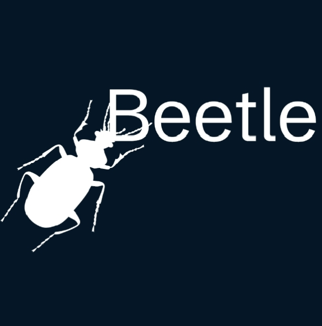

# The Beetle Programming Language
Beetle is a programming language I made because I wanted to create a fast programming language for fun. Beetle scripts have the file extension .Beetle. The language is influenced within Rust, C, C++, Zig, and finally Python. Beetle was made in python

Before using Beetle, Know that there is no documentation, bugs may appear, not enough syntax support. Adding more stuff will be supported on the next version and optimizations may be added.

# Our Performance
We have a great performance. It ranges from 0.2 to 0.3 seconds to print ranging 1 to 99999.

# Installation
We are going to list a tutorial for each operating system, Note that some operating systems are not supported yet.

# Windows, Linux
Not Supported Yet, But you can currently achieve this by currently using our open-source beetle compiler

# Android

You can achieve this by first downloading an python interpreter, Then implement our open source compiler to the file you need to create.

# Beetle Code Examples

Adding a variable that is a float:
``` Beetle
e = (sqrt(5)+1)/2

print(e+1)
```

Note that beetle has some python syntax, So it's pretty easy to learn Beetle.

``` Beetle
e = input()
fn say(e):
 print(e+1)
```
